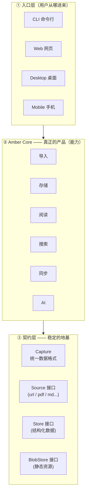
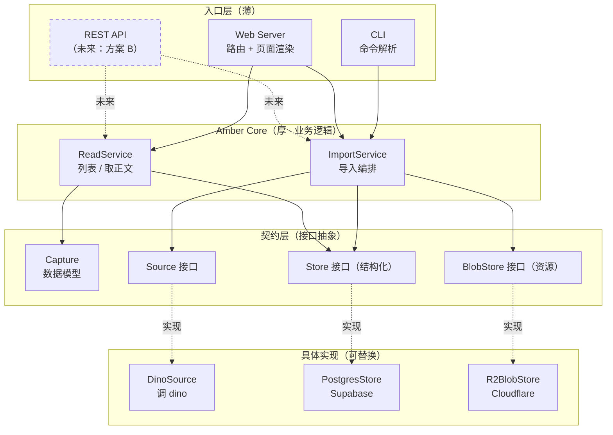
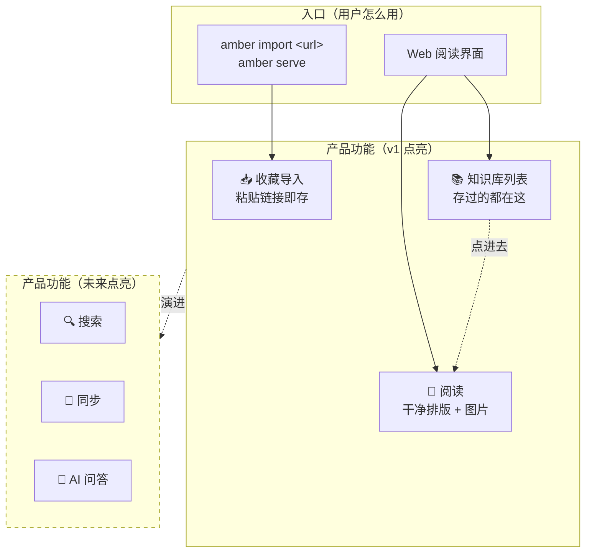
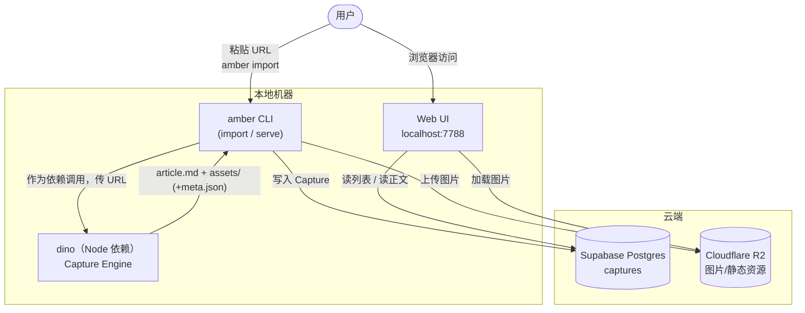
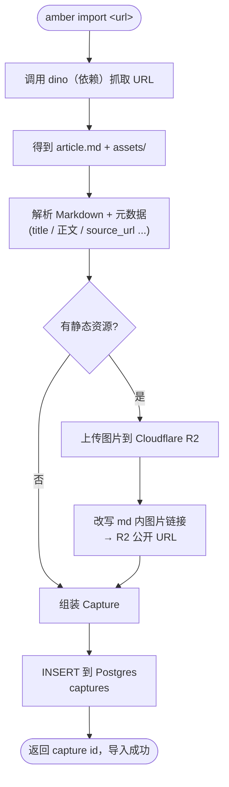
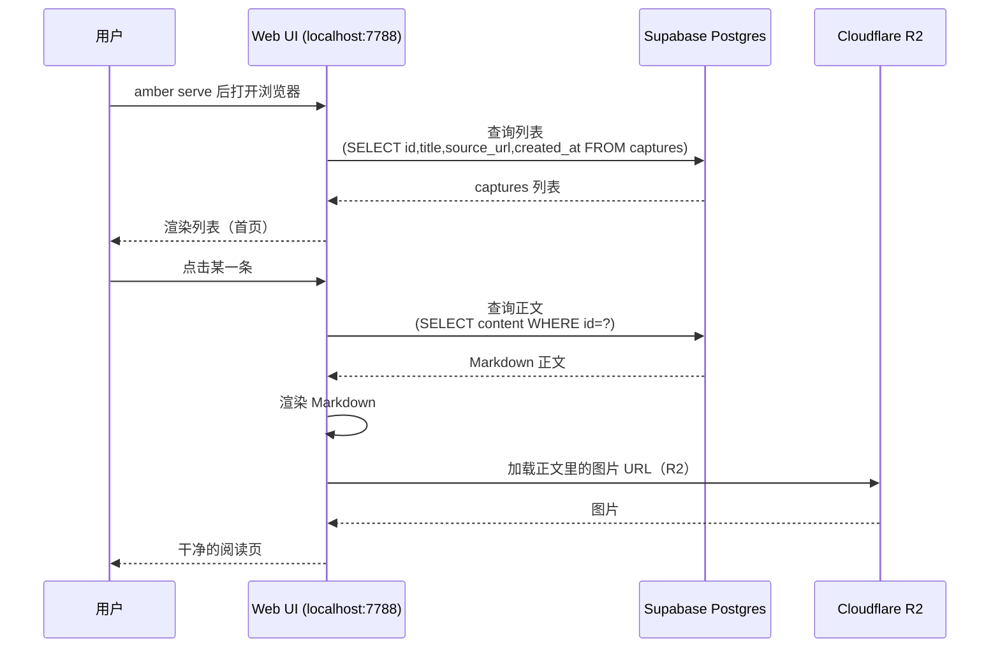

# Amber 整体架构与 v1 设计

> 日期：2026-05-30
> 状态：已确认，待实现规划

本文档分两部分：
- **第一部分（§1–§4）整体架构**：贯穿所有版本的稳定骨架，以及版本演进路线。这是"楼的结构"，技术栈基调、Core 形态与设计纪律都在这里。
- **第二部分（§5–§11）v1 设计**：在整体架构上要盖的第一层，可立即开工。

## 1. 背景与定位

Amber 是一个 **Personal Knowledge Pipeline**：把收集到的内容长期保存，并在未来能方便地重新阅读和利用。

此前的 spec（docs0–2）由 AI 生成，过早陷入数据库、向量检索、RAG 等技术细节，而产品形态尚未想清。docs3 做了纠偏（技术服务于产品形态、CLI 先行、聚焦获取/保存/阅读）。本设计在 docs3 基础上，先确立**贯穿各版本的整体架构骨架**，再通过场景挖掘收窄出一个**可立即开工的 v1 范围**——让 v1 成为整体架构的第一步，而非孤立实现。

**核心原则：架构骨架一次想清楚，能力按版本逐步点亮；v1 只点亮核心 Pipeline 的最小闭环，但其代码以"未来能无痛演进"的方式编写。**

## 2. 整体架构（贯穿所有版本）

### 2.1 三层骨架

Amber 是一栋三层楼：**入口层随版本越加越多，Core 是真正的产品，契约层永远不变。**



- **入口层**：用户用什么访问。不管从哪进来，调用的都是同一套 Core 能力。
- **Amber Core**：产品的真正本事（导入/存储/阅读/搜索/同步/AI）。
- **契约层**：稳定接口——所有内容归一成 `Capture`；存储分两个职责不同的接口：`Store`（结构化数据，如 Postgres）与 `BlobStore`（静态资源，如 R2），都藏在接口之后。这层定好，上层增删能力都不会动摇地基。

### 2.2 版本演进 = 点亮能力，不是重建

每一版站在上一版的地基上"点亮"一个 stage，不砸墙重建。

| 能力 | v1（现在） | v2 | v3 |
|---|---|---|---|
| 导入 Import | url（dino） | +PDF / Markdown / 笔记 | |
| 存储 Store | Postgres + R2 | | |
| 阅读 Read | 列表 + 单篇阅读 | +分组 / 筛选 | |
| 搜索 Search | — | 全文搜索 | +语义 / 向量 |
| 同步 Sync | （云端天然多设备读） | 账号 / 离线 / 冲突 | |
| AI | — | — | Recall / Synthesis 问答 |

### 2.3 技术栈基调

- **运行时 / 语言**：Node.js 生态。amber 是一个 Node 程序，对外提供 `amber` CLI。
- **Dino 集成方式**：dino 已开发完成，作为 **Node 依赖直接引入调用**（不是外部子进程命令），对应契约层的 `DinoSource` 实现。
- **未定（留到实现规划阶段定，不影响整体架构）**：Web server 框架、Markdown 渲染方案、CLI 框架、配置/凭证管理方式、错误处理与去重的具体策略。这些是实现细节，按设计纪律它们都被锁在入口层或具体实现内，不影响骨架。

### 2.4 Core 形态：v1 用库，按"可演进为服务"编写

整体架构里最影响未来的决定，是 Amber Core 的形态：

- **方案 A（采用）— Core 是库（in-process）**：v1 中 CLI 与内嵌 web server 在同一进程内直接调用 Core 函数。简单、快，适合"自己电脑上用"。
- **方案 B（未来）— Core 是服务（HTTP API）**：CLI / Web / Mobile 通过网络 API 调 Core。一开始就支持远程与多端，但 v1 复杂度高。

**决定**：v1 采用方案 A（自己电脑本地用），但**预留演进到 B 的路**——因为用户明确未来要"部署到服务器、手机访问"。

### 2.5 贯穿各版本的设计纪律（演进就绪）

为保证"点亮能力"和"A→B 演进"不返工，所有版本的代码须遵守：

1. **入口层薄、Core 厚**：CLI / web handler 只做参数解析与调用，所有业务逻辑在 Core。换/加入口不碰业务。
2. **Core 能力函数无状态、接口清晰**：每个能力是"输入参数 → 输出结果"的纯函数式接口，形如未来 HTTP API 的 handler。要演进到方案 B，只是在 Core 外面包一层 HTTP，而非改内部。
3. **契约层隔离外部依赖**：`Source`（采集来源）、`Store`（结构化存储）、`BlobStore`（资源存储）都通过接口抽象。加 PDF 来源 = 实现一个 Source；换/加存储 = 实现一个 Store 或 BlobStore。Core 不直接依赖 dino、Postgres、R2 的具体实现。
4. **数据统一为 Capture**：任何来源最终都归一成同一结构，下游（阅读/搜索/AI）只认 Capture。

这四条是整体架构的"承重墙"，任何版本都不能破坏。

### 2.6 技术架构图（工程 / 代码视角）

把三层骨架落到代码上：入口层薄、Core 厚、依赖通过契约层接口隔离、具体实现可替换。这张图是"代码地图"。



对应四条承重墙：
- **入口层薄**：`CLI` / `Web Server` 只解析请求即转调 Core；未来加 `REST API`（方案 B）也只是再加一个入口，Core 不动。
- **Core 厚**：`ImportService`（编排 import 全流程）、`ReadService`（列表 / 取正文）承载全部业务，且只依赖契约层接口，不知道背后是 dino 还是 Postgres。
- **契约层**：`Source` / `Store` / `BlobStore` 三个接口 + `Capture` 模型。
- **具体实现可替换**：`DinoSource` / `PostgresStore` / `R2BlobStore`。未来加 PDF 来源 = 加一个 `PdfSource`；换存储 = 换一个实现，Core 一行不改。

## 3. 核心数据契约：Capture

`Capture` 是贯穿所有版本的统一数据格式，是契约层的核心——一段被收藏、被永久保存下来的内容（v1 是网页文章，未来是 PDF、Markdown、笔记）。用户收藏它、在列表里看到它、打开阅读它。

命名叙事：**Dino 是 Capture Engine（抓取能力）→ 抓回来的每一份内容，在 Amber 里就是一条 Capture（数据模型）。** "我的 captures" 即用户的知识库。注意区分二者——`Capture` 在本文档指数据模型（名词）；dino 的 "Capture Engine" 是对其抓取能力的描述，不是同一个东西，代码中也不共用类型。

v1 只用到其中一部分字段，但结构从一开始就为演进预留。详细 v1 字段见 §9。

## 4. 整体开发路线

```
v1：CLI + 核心 Pipeline 闭环（导入 url → 云端存储 → 网页阅读）   ← 本文档第二部分
v2：多来源导入 + 全文搜索 + 同步（账号/离线）
v3：语义搜索 + AI 问答；Core 视需要演进为服务（方案 B），开放 Web/Mobile 远程访问
```

---

# 第二部分：v1 设计

**v1 是整体架构的第一步：搭起三层骨架，点亮"导入(url) / 存储 / 阅读"三盏灯，其余能力留接口、不实现。**

### 与 Dino 的关系

- **Dino = Capture Engine（独立）**：输入 URL，输出 `article.md` + `assets/`（未来增加 `meta.json` 承载元数据）。dino 已开发完成，其输出结构可按 amber 需要调整。
- **集成方式**：dino 作为 **Node 依赖被 amber 直接引入调用**，封装在契约层的 `DinoSource` 实现内。dino 仍是职责独立的 Capture Engine（amber 不改其内部逻辑），但工程上是依赖关系，不是外部子进程命令。
- **Amber = Knowledge Engine**：负责 Markdown → 存储 → 阅读。

## 5. v1 范围

### 做（核心 Pipeline 闭环）

```
网页 URL → import → 存到云端 → serve → 网页列表 + 阅读
```

具体三件事（用户最初判断为"地基，从下往上搭"）：

- **A. 保存**：`amber import <url>`，用户自己粘贴链接。
- **B. 阅读**：`amber serve` 起本地 Web 服务，浏览器访问，首页是列表，点进去读单篇。
- **C. 存储**：数据从一开始就落在云端。结构化数据用 **Supabase Postgres**，静态资源（图片等）用 **Cloudflare R2**。

### 不做（明确排除，避免重蹈 docs0–2 覆辙）

- ❌ 搜索（全文 / 语义）、关联、推荐
- ❌ AI / Agent / RAG / 向量检索 / pgvector
- ❌ 知识图谱、协同编辑、Tiptap、Canvas
- ❌ **同步功能本身**（账号体系、冲突合并、离线优先）
- ❌ 浏览器扩展 / bookmarklet（GUI 阶段以后再说）
- ❌ Desktop / Mobile 客户端

### 一个关键的设计取舍

**"C 不做同步" ≠ "数据存本地"。**

数据从一开始就在云端 Postgres。这带来一个有意的副作用：**多设备"读"天然就有了**——任何机器 `amber serve` 连的是同一个库。我们绕开了同步中最难的部分（冲突合并、离线、账号），却拿到了跨设备最核心的价值（到处都能看）。这是 v1 范围里最聪明的一个决定，需要在实现时守住——不要因此就去做同步逻辑。

## 6. 产品架构与形态

### 6.1 产品架构图（用户 / 功能视角）

Amber 由哪些功能模块构成、用户感知到什么。实线框是 v1 点亮的功能，虚线框是未来才点亮的。



v1 上线后用户实际用到的就三块：**收藏导入、知识库列表、阅读**。

### 6.2 产品形态

- **入口**：CLI（`amber import` / `amber serve`）。CLI 先行的原因是开发快、验证核心能力快，**不是**因为只给开发者用——Amber 最终是带 GUI 的产品，但那是后续阶段。
- **阅读载体**：Web。`amber serve` 自身提供本地 web server（同一个 CLI 进程起的），浏览器访问 `localhost:7788`。选 Web 是为了顺势过渡到后续的 Web/Desktop 形态。
- **首页**：列表——存过的内容都在这，一眼能扫，点一条进去读。列表展示哪些字段、是否分组/筛选 **v1 待定**，先最简：能列出来、能点进去读。
- **阅读页**：干净渲染 Markdown（含 dino 抓下来的图片等静态资源），能舒服读完一篇。

## 7. v1 架构与数据流

### 7.1 部署架构图



### 7.2 `amber import` 流程图



### 7.3 `amber serve`（阅读）流程图



## 8. 关键设计决定

1. **dino 作为 Node 依赖被 amber 直接调用**，封装在 `DinoSource` 内。dino 职责独立（amber 不改其逻辑），但工程上是依赖关系而非外部子进程。
2. **正文 Markdown 存 Postgres 字段**，不存对象存储；只有图片等二进制走 Cloudflare R2。
3. **图片链接在 import 时即改写成 R2 公开 URL** 并持久化进正文。serve 时直接读，不在阅读时做转换。
4. **Web UI 由 `amber serve` 自身提供**（同一 CLI 进程起的本地 web server），不是独立部署的前端。
5. **存储分两家**：结构化数据用 Supabase Postgres，静态资源用 Cloudflare R2。选 R2 是因为其出口流量免费、单价更低，且这是项目早晚要用的方案，一开始就上可避免后续迁移。代价是 v1 多一个服务依赖（一套 R2 凭证 + 上传客户端），已接受。

## 9. 数据模型（v1 初稿）

v1 只需一张核心表。字段在实现规划阶段细化，此处给出方向：

```
captures
  id            uuid (pk)
  title         text
  content       text          -- 正文 Markdown，图片链接已改写为 R2 公开 URL
  source_url    text          -- 原始网页地址
  source_type   text          -- v1 固定为 'url'，为未来 pdf/markdown/note 预留
  created_at    timestamptz
  captured_at   timestamptz
```

- 图片等静态资源不入表，存 Cloudflare R2；正文里以 R2 公开 URL 引用（前提：R2 bucket 配置为公开访问，v1 接受公开 URL，私有化见 §11）。
- **不**引入 embeddings / tags / assets 等表——那是 v1 之外的能力，避免提前设计。但表结构上保持简单可扩展，不做出未来无法加表的设计。

## 10. 验收标准（v1 完成的定义）

1. `amber import <url>`：粘贴一个网页链接，命令成功后，该网页正文已存入 Supabase Postgres，图片已上传至 Cloudflare R2 且正文链接已改写。
2. `amber serve`：启动后浏览器打开 `localhost:7788`，首页能看到已导入 captures 的列表。
3. 点击列表中任一条，进入阅读页，Markdown 正文与图片都正常显示、排版干净。

附带验证（可选，非必须验收项）：在另一台机器上 `amber serve`（连同一个 Supabase），能看到并阅读相同内容——这是云端存储的天然副产品，不应作为卡住 v1 的硬性门槛。

说明：v1 列表不分页，可接受；分页等富展示见 §11。

## 11. 后续阶段（不在 v1，仅记录方向）

- 同步逻辑（账号、离线、冲突）
- R2 资源访问控制（v1 用公开 URL，未来如需私有内容可换签名 URL）
- 搜索（先全文，再考虑语义）
- 更多 source_type（PDF、Markdown 文件、笔记）
- 列表的分组/筛选/富展示
- Web / Desktop GUI 形态
- AI / Recall / Synthesis

这些都建立在 v1 核心 Pipeline 闭环之上，地基不稳之前不动它们。
