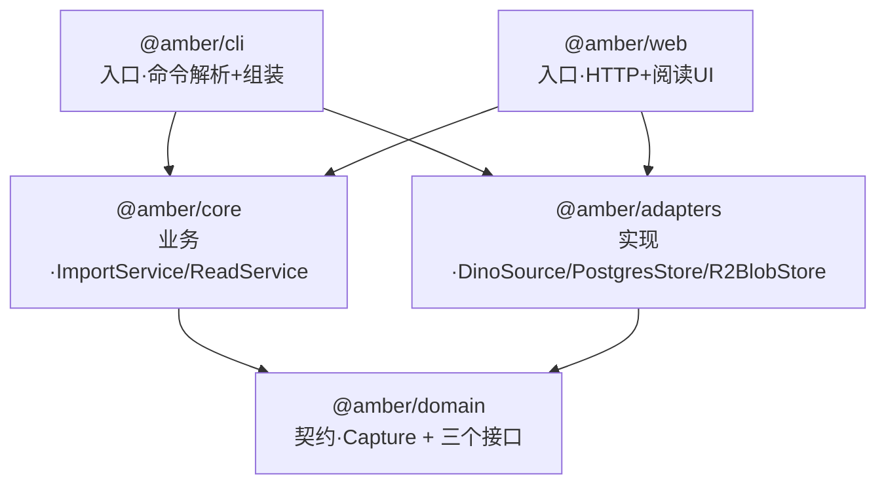

# Amber v1 技术方案

> 日期：2026-05-31
> 状态：已确认，待实现规划
> 关联：[整体架构与 v1 设计](./2026-05-30-amber-v1-design.md)

本文档把 [v1 设计](./2026-05-30-amber-v1-design.md) 落到工程实现层面：包划分、技术选型、契约层类型。设计文档回答"做什么"，本文回答"用什么、怎么组织"。

## 1. 工程结构：pnpm monorepo

按三层骨架切包，依赖单向向下，边界由编译器（包边界）强制，而非靠目录约定自律。



| 包 | 职责 | 依赖 | 骨架层 |
|---|---|---|---|
| `@amber/domain` | `Capture` 数据模型 + `Source`/`Store`/`BlobStore` 接口。**零运行时依赖**（纯类型/接口） | 无 | 契约层 |
| `@amber/core` | `ImportService` / `ReadService`，业务编排，只依赖接口 | domain | Core |
| `@amber/adapters` | 三个具体实现：调 dino、连 Postgres、传 R2 | domain + 外部库 | 具体实现 |
| `@amber/cli` | `amber import` / `amber serve`，解析命令并**组装**（实例化 adapters 注入 core） | core, adapters | 入口层 |
| `@amber/web` | HTTP 服务 + 阅读页（列表 / 文章） | core, adapters | 入口层 |

**关键纪律**：`@amber/core` 不依赖 `@amber/adapters`，只认 `@amber/domain` 的接口。具体实现的实例化（组装/依赖注入）发生在入口层（cli / web）。这是演进到设计文档 §2.4 方案 B（服务化）的基础——届时 `@amber/web` 可独立为服务，`@amber/cli` 改为调用它，core / adapters 不动。

命名说明：契约层取名 `domain`（领域模型 + 领域接口），而非 `contracts`/`shared`——前者是通用且精确的术语，后者抽象或易沦为垃圾桶包。

## 2. 技术选型

### 2.1 通用工具链

| 决策点 | 选型 | 说明 |
|---|---|---|
| 语言 / 运行时 | TypeScript + ESM + Node ≥ 24 | 与 dino 一致 |
| 包管理 | pnpm workspace | monorepo |
| 构建 | **tsdown**（Rolldown 驱动） | 比 tsup 快，API 接近 |
| 开发运行 | tsx | 免构建直接跑 TS |
| 测试 | vitest | 与 dino 一致 |

### 2.2 各模块选型

| 模块 | 选型 | 理由 |
|---|---|---|
| 采集（DinoSource 内部） | 调用 dino | dino 为黑盒：给 URL，拿回 `{markdown, 元数据, 图片}`。具体调用方式封装在 `DinoSource.capture()` 内，不外溢到架构层 |
| 结构化存储 | **Prisma ORM** | `schema.prisma` 管表结构 + migration + 生成类型化 client，一站式。`PostgresStore` 用 Prisma Client 实现。不引入 postgres.js |
| 资源存储 | **@aws-sdk/client-s3** | R2 为 S3 兼容，指向 R2 endpoint |
| Web 框架 | **Hono** | 轻、现代、可移植；未来方案 B 把 core 包成 HTTP 服务时可直接复用 |
| 阅读页渲染 | **服务端渲染：markdown-it → HTML + 极简 CSS** | v1 阅读页是只读静态内容（列表 + 文章两页），不引入前端框架，避免为未到来的 GUI 提前买单 |
| 配置 / 凭证 | **.env（dotenv）** | Supabase 连接串、R2 keys。`amber init` 等体验后续再说 |

### 2.3 CLI 技术栈

CLI 由三个职责清晰的库组合：

| 库 | 职责 |
|---|---|
| **citty**（unjs） | 命令与参数解析（`amber import <url>` / `amber serve`） |
| **clack**（@clack/prompts） | 交互式问答（如确认、选择、输入提示） |
| **Ink** | 终端 UI 渲染（列表等；v1 先做简单列表展示） |

流程：citty 解析命令 → 需要交互时用 clack 问答 → 需要富展示时用 Ink 渲染。不使用 commander。

注：`@amber/cli` 因 Ink 依赖 React；`@amber/web` 阅读页为服务端渲染、不依赖 React。两个入口包技术栈各自独立，互不影响——正是 monorepo 分包的收益。

## 3. 契约层类型（`@amber/domain`）

```ts
// ── 核心数据模型 ───────────────────────────────
interface Capture {
  id: string;            // uuid
  title: string;
  content: string;       // markdown，图片链接已改写为 R2 公开 URL
  sourceUrl: string;
  sourceType: 'url';     // 联合类型，未来扩展 'pdf' | 'markdown' | 'note'
  author?: string;
  createdAt: string;     // ISO 8601
  capturedAt: string;    // ISO 8601
}

type CaptureSummary = Pick<Capture, 'id' | 'title' | 'sourceUrl' | 'createdAt'>;

// ── 采集来源：给输入，拿回未落库的原始素材（含图片二进制）──
interface Source {
  capture(input: string): Promise<RawCapture>;
}

interface RawCapture {
  title: string;
  markdown: string;      // 图片处为稳定占位符（如 amber-asset:0），待替换为 R2 URL
  author?: string;
  publishedAt?: string;
  assets: Asset[];
}

interface Asset {
  placeholder: string;   // markdown 中对应的占位符，如 "amber-asset:0"
  data: Uint8Array;      // 图片二进制
  contentType?: string;
}

// ── 结构化存储 ───────────────────────────────
interface Store {
  insert(capture: Capture): Promise<void>;
  list(): Promise<CaptureSummary[]>;                      // 列表页
  get(id: string): Promise<Capture | null>;              // 文章页
  findBySourceUrl(url: string): Promise<Capture | null>; // 去重
}

// ── 资源存储 ───────────────────────────────
interface BlobStore {
  put(key: string, data: Uint8Array, contentType?: string): Promise<string>; // 返回公开 URL
}
```

## 4. 核心业务流程（`@amber/core`）

### 4.1 ImportService.import(url)

1. **去重前置**：`store.findBySourceUrl(url)`，已存在则按策略短路（v1 策略实现阶段定，不入架构）。先查再抓，避免对已存在 URL 白跑一遍 dino。
2. `source.capture(url)` → `RawCapture`（markdown 带占位符 + 元数据 + 图片二进制）
3. 逐个 `blobStore.put(key, asset.data, asset.contentType)` 上传图片，得到 R2 URL（`key` 由 core 生成，BlobStore 只负责存）
4. 把 markdown 中每个 `asset.placeholder` 机械替换为对应的 R2 URL（`markdown.replaceAll(placeholder, r2Url)`，无歧义）
5. 组装 `Capture`（id 由应用层生成、capturedAt 等）
6. `store.insert(capture)`
7. 返回 capture id

### 4.2 ReadService

- `list()` → `store.list()` → `CaptureSummary[]`（列表页）
- `get(id)` → `store.get(id)` → `Capture`（文章页，content 已含 R2 图片 URL）

> dino 怎么调、Prisma 怎么查、S3 client 怎么传——都封装在 `@amber/adapters` 的三个实现内，core 全程只面向 `@amber/domain` 的接口。

## 5. 数据库 Schema（Prisma）

对应设计文档 §9 的 `captures` 表。Prisma schema 字段方向：

```prisma
model Capture {
  id         String   @id @default(uuid()) @db.Uuid  // 应用层（Prisma）生成
  title      String
  content    String                          // markdown，映射到 Postgres text（不限长，勿改 VarChar）
  sourceUrl  String   @map("source_url")
  sourceType String   @default("url") @map("source_type")
  author     String?
  createdAt  DateTime @default(now()) @map("created_at")
  capturedAt DateTime @map("captured_at")

  @@map("captures")
}
```

> `schema.prisma` 与生成的 Prisma Client 放在 monorepo 哪个包、如何被 adapters 引用，留到实现规划阶段定（不影响架构）。

## 6. 待实现规划阶段细化（不属于技术方案/架构）

以下为实现细节，按设计纪律封锁在入口层或具体实现内，留到 writing-plans 处理：

- 重复导入 / 部分失败（图片传一半 PG 失败）的具体策略
- R2 对象 key 命名规则、bucket 公开访问配置
- 端口可配置、`amber serve` 启动细节
- 配置缺失时的报错与引导
- Prisma schema/client 在 monorepo 的具体放置
