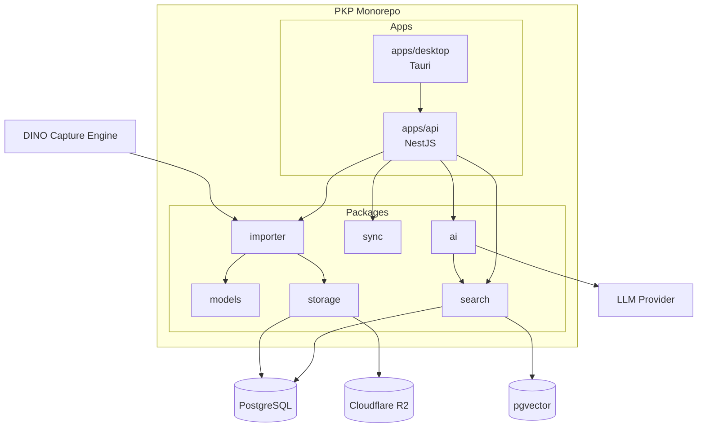
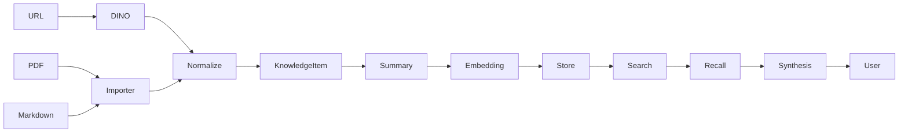
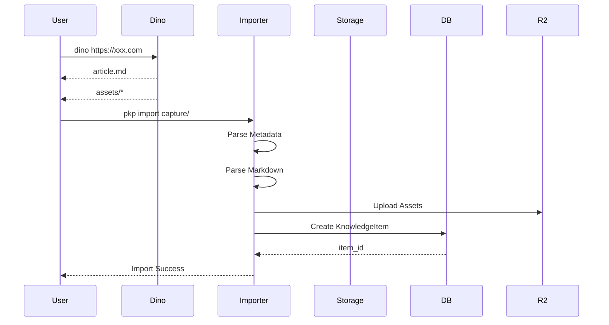
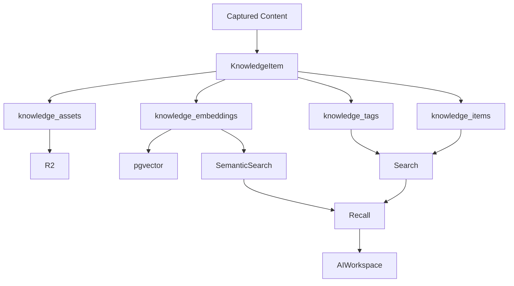
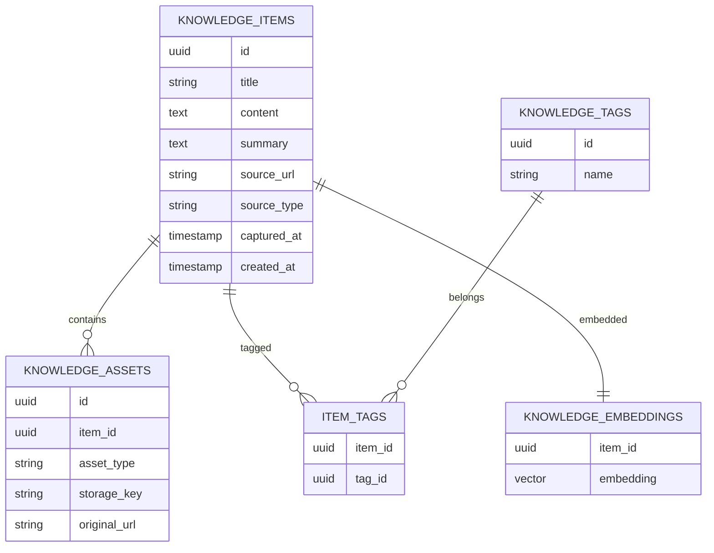
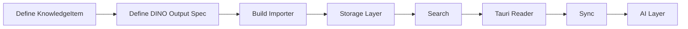

我建议先画两个图：

1. **系统架构图（Repository / Service Architecture）**
2. **知识流转与数据库流转图（Data Flow）**

这是当前阶段最重要的两个图。

---

# 1. PKP 整体架构图



---

# 2. Knowledge Pipeline

这是产品核心。



---

# 3. DINO -> PKP 导入流程

这是你下一步真正要开发的。



---

# 4. 数据库流转图（当前最关键）

这个是我认为未来 1~2 年都不会大改的。



---

# 5. 数据模型 ER 图（V1）



---

# 6. 我认为当前真正的开发顺序



这个顺序最大的好处是：

```text
DINO
 ↓
KnowledgeItem
 ↓
Storage
 ↓
Search
```

先形成闭环。

而不是一开始就陷入：

```text
Tiptap
协同编辑
知识图谱
Agent
```

这些暂时还不会产生实际价值的功能。
